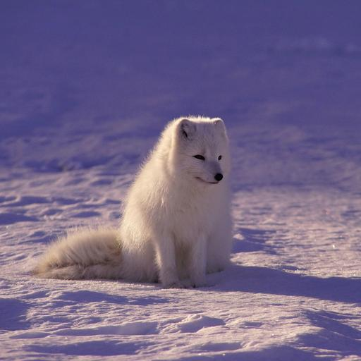
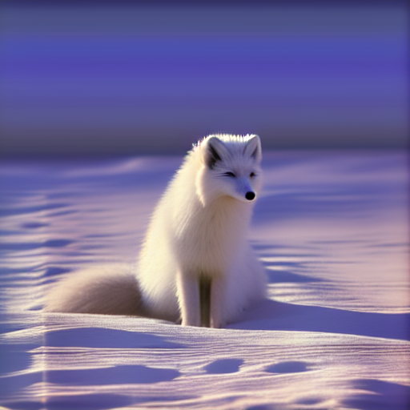
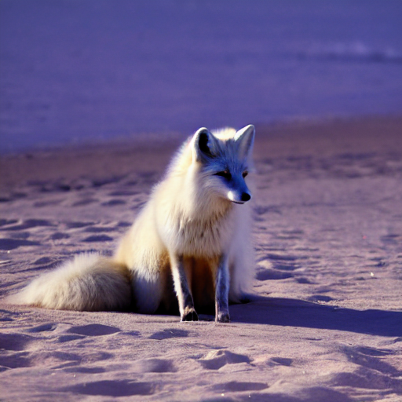
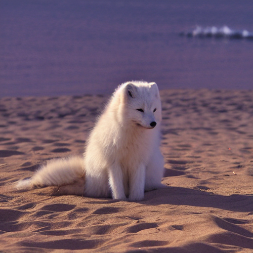
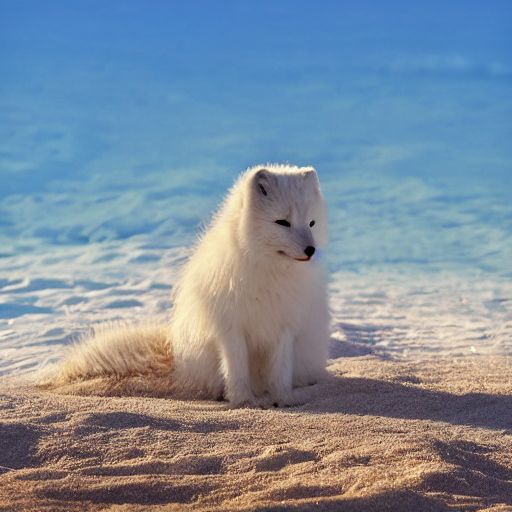
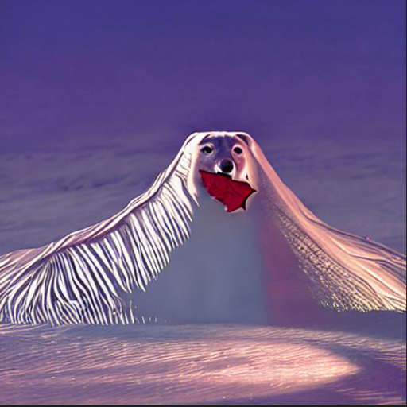
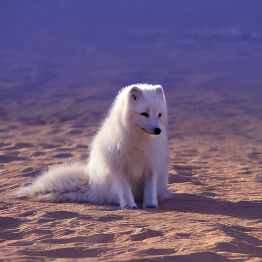
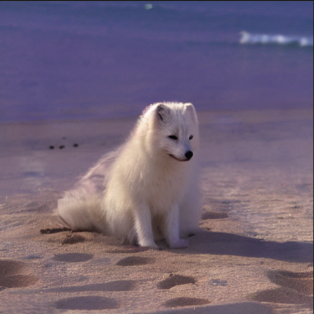

# LMM Score: GPT-4V Prompt Template

## Prompt:
I invite you to participate in an experiment on "Evaluation of Image Editing Performance with Different Methods". Be patient and focus. I will pay you tips according to your performance. Are you ready now?

## ChatGPT:

I'm ready and intrigued! Let's dive into the experiment. How can I assist you with the evaluation?

## Prompt:

Step 1: I will provide a source image, a task indicator meaning which specific task is being performed, and an editing instruction that guides the editing process on the source image. Please first view the images and describe the source image. Then describe the editing process.

## ChatGPT:

Please go ahead and provide the source image, task indicator, and editing instruction. I'll start by describing the source image once I see it.

## Prompt:
<button></button>

This is the source image. 

Task indicator: Background Change. 

Editing Instruction: Change the snowland to a beach.

## ChatGPT:

The source image features an arctic fox sitting on snow-covered ground. The fox has thick, white fur which provides camouflage against the snowy backdrop. The scene appears to be in a natural, possibly Arctic, environment, given the animal and the snow. There's a soft glow that suggests either early morning or late afternoon light, and the background is predominantly white due to the snow, with some shades of purple, likely due to the lighting or shadows.

For the editing process as per your instruction, the snowland in the background would be replaced with a beach setting. This would involve removing the snowy ground and any snow-related features from the background and introducing elements typical of a beach scene, such as sand, perhaps some ocean or sea in the distance, and possibly a blue sky. The lighting and shadows on the fox might also need to be adjusted to match the typical lighting one would find in a beach environment, which tends to be brighter and warmer in tone.

## Prompt:
Step 2: Now there are 8 edited images which are edited from the source image by 8 different methods with the same one editing instruction mentioned before. You are required to first pay enough careful examination of the 8 edited images. Then you need to score each one based on each of the four following evaluation factors separately, resulting in 4 sub-scores ranging from 1 to 10, termed $S_{acc}, S_{pre}, S_{qua}, S_{real}$, respectively. A higher score means better. The four factors are: 

1. Editing Accuracy: Evaluate how closely the edited image adheres to the specified editing instruction, measuring the precision of the editing. 

2. Contextual Preservation: Assess how well the edited image maintains the context of the source image that should not be changed. 

3. Visual Quality: Assess the overall visual quality of the edited image. 

4. Logical Realism: Evaluate how logically realistic the edited image is in terms of adherence to natural physical laws. 

Before scoring, carefully specify what to be concerned in each factor in this case. This can help you score more accurately. After that, I will upload the 8 edited images one by one. When I upload one image each time, you first give a detailed analysis based on the factors. After I upload them all, you can score them for comparison. Are you clear?

## ChatGPT:

Absolutely clear. Before scoring, let's define the criteria for each evaluation factor in the context of changing the background from a snowy landscape to a beach scene:

1. **Editing Accuracy ($S_{acc}$):** This assesses how well the beach replaces the snowy environment without affecting the fox. Key concerns would include whether the snow is completely replaced by sand, if the boundary between the fox and the new background is seamless, and if elements such as the ocean, sky, or beach accessories (like seashells, starfish, etc.) have been added appropriately.

2. **Contextual Preservation ($S_{pre}$):** This evaluates the maintenance of the source image's context that shouldn't be altered, particularly the fox. Points to check are whether the fox remains unaltered in terms of appearance, pose, and shadow, and if the new background is adjusted to maintain the original lighting and perspective context.

3. **Visual Quality ($S_{qua}$):** Here, the overall aesthetic appeal of the image is judged, including the resolution, absence of artifacts, color harmony between the fox and the new background, and the natural integration of the beach scene.

4. **Logical Realism ($S_{real}$):** This factor gauges the believability of the edited image. It involves assessing whether the fox looks like it could naturally exist in the beach setting, whether the shadows and lighting on the fox match the new environment, and if the scale and perspective of the beach elements align with the fox.

I'm ready to analyze the edited images based on these factors. Please upload the images when you are ready.

## Prompt:
<button></button>

The first edited image.

## ChatGPT:

In the provided edited image, the snowy background has been replaced with what seems to be a sandy beach. The following is a detailed analysis based on the four factors:

1. **Editing Accuracy:** The initial instruction was to transition the environment from a wintry snowscape to a coastal beach setting. Here, the original snow has been substituted with sand, which indicates a direct approach to the task. However, this change does not extend to a complete representation of a beach; essential elements like the sea, sky, and possibly vegetation or beach artifacts are missing. The alteration is fundamental but not comprehensive.

2. **Contextual Preservation:** The subject of the original image, the arctic fox, has been largely conserved in situ with meticulous attention to its defining characteristics. The preservation here is good as the creature remains unaltered and is the clear focal point of the composition, ensuring that the essence of the original image is intact.

3. **Visual Quality:** Assessing the aesthetic merits of the edit, there's a satisfactory level of finesse in blending the fox into its new context. Nevertheless, there is room for enhancement in terms of resolution and clarity to elevate the visual narrative. The current state presents an agreeable visual output, yet it doesn’t quite reach the zenith of high-definition quality.

4. **Logical Realism:** The logical realism of this image is challenging. While the fox is well integrated into the scene, the color of the sand doesn't align with natural sand colors, and the lighting has a purple hue that is atypical for a beach setting, making it less believable as a real beach environment.

I'll hold off on scoring until I've seen all eight images to ensure a fair comparison. Please upload the next image when ready.

## Prompt:

<button></button>

The second one.

## ChatGPT:

In this second edited image, the arctic fox is placed against a background that seems to be a dusk or dawn beach scene. Here’s the analysis based on the reference points provided:

1. **Editing Accuracy:** The sandy beach setting is apparent, and there is a hint of the ocean in the background. The edit adheres to the instruction to change the snowland to a beach, and this is achieved with a noticeable level of detail.

2. **Contextual Preservation:** The integrity of the fox is maintained with no apparent distortion. However, there is a slight alteration in the shadow under the fox, which seems to be darker and more pronounced than in the original image. The fur texture and the overall posture of the fox remain consistent with the source image.

3. **Visual Quality:** This image displays an increase in visual quality. The blending of the fox into the sandy beach is executed with a higher degree of finesse, and the image is free from any noticeable editing artifacts. The colors are vibrant and draw the viewer's eye.

4. **Logical Realism:** The setting sun gives the beach a purple hue that complements the fox's fur, and the shadowing beneath the fox is consistent with this lighting. The positioning of the fox and the inclusion of the ocean add to the image's realistic portrayal of a beach scene.

The overall appearance of this edit is of a higher quality, taking into account the effort to create a believable beach environment around the arctic fox. The elements combined here result in a coherent and aesthetically pleasing image. Please upload the next image for analysis.

## Prompt:

<button></button>

The third one.

## ChatGPT:

In the third edited image, the fox is seated on a surface that resembles beach sand, with the ocean visible in the background. Here's an analysis based on the evaluation factors:

1. **Editing Accuracy ($S\_{acc}$)**: The editing reflects the task instruction, replacing the snow with a sandy beach. The ocean is present, and the sand has a natural color, which aligns with the requested beach setting.
2. **Contextual Preservation ($S\_{pre}$)**: The fox is well-preserved with no noticeable distortion, maintaining the source context. However, the shadow cast by the fox appears slightly off in direction and intensity when compared to the original image's lighting context.
3. **Visual Quality ($S\_{qua}$)**: The image maintains a high level of visual quality. The sand's texture is distinct, and the fox is clear and sharply defined. The background and foreground are balanced, contributing to a high-quality visual appearance.
4. **Logical Realism ($S\_{real}$)**: This image has an improved sense of realism. The beach environment is believable, and the fox's integration into this setting is convincing. The shadow, while slightly off, does not severely detract from the realism. The overall lighting still carries a purple hue, which affects the natural appearance of the scene.

Awaiting the remaining images for final scoring. Please upload the next image when ready.

## Prompt:

<button></button>

The fourth one.

## ChatGPT:

For the fourth edited image, the arctic fox is set against a beach scene that appears to be taken at a similar time of day as the previous images, with a gentle purple cast to the light:

1. **Editing Accuracy:** The transformation of the snow to sand is convincingly done, suggesting a careful application of the editing instruction. The ocean in the background, while minimal, does contribute to the beach scene.

2. **Contextual Preservation:** The fox's appearance is consistent with the original image. The fur texture and coloration appear unchanged, preserving the context. The shadow under the fox, however, seems a bit mismatched both in terms of direction and intensity, suggesting an alteration that does not completely align with the original lighting.

3. **Visual Quality:** The image presents a clear and crisp depiction of the fox. The sand texture is well defined, and the composition is visually appealing. However, the purple cast over the image affects the natural color balance one would expect in a beach setting.

4. **Logical Realism:** The realism is somewhat compromised by the purplish hue, which is not typical for a sunny beach scene. Although the fox is well-placed in the sand, the shadow's direction and the overall color cast may reduce the logical realism of the scene.

The edit represents a competent blend of the source image with the new beach background, achieving a harmonious and believable scene. Please continue with the next image.

## Prompt:
<button></button>

The fifth one.

## ChatGPT:

The fifth image displays the arctic fox sitting on a surface that, upon initial glance, seems to be a sandy beach. However, a detailed look reveals some incongruities:

1. **Editing Accuracy:** The foreground where the fox sits has the texture of sand, matching the task of changing the snow to a beach. Yet, the background, with its light blue coloration, is reminiscent of snow rather than the typical brown or golden sands of a beach.

2. **Contextual Preservation:** The fox itself is untouched and retains its natural state from the original image. The integrity of the animal’s image within this new context is commendable.

3. **Visual Quality:** The image quality around the fox is quite good, with the fur texture sharply contrasting against the background. Nonetheless, the background's resemblance to snow rather than sand somewhat diminishes the visual coherence of a beach scene.

4. **Logical Realism:** While the foreground does suggest a beach setting, the background's light blue hue disrupts the logical realism. The setting behind the fox lacks the definitive characteristics of a beach, potentially confusing the viewer's sense of place.

In essence, while the foreground aligns well with the intended beach setting, the background introduces elements that detract from the beach atmosphere, creating a dissonance that impacts the overall realism of the scene. Please present the next image.

## Prompt:

<button></button>

The sixth one.

## ChatGPT:

In this sixth edited image, there is a significant departure from the original source in terms of the background as well as the fox:

1. **Editing Accuracy:** The edit does not accurately reflect the task of changing the snowy background to a beach. Instead, the background remains snow-like in color and texture, and the fox has been altered dramatically, now resembling more of an abstract or surreal figure with wing-like extensions.

2. **Contextual Preservation:** The context of the original image has not been preserved. The fox's natural appearance has been heavily modified, losing the authenticity of the original image and the natural portrayal of the animal.

3. **Visual Quality:** The visual quality of the image has been compromised. The editing introduces elements that are quite abstract, and the integration between the fox and these elements does not provide a realistic or high-quality visual representation.

4. **Logical Realism:** The image does not convey a sense of logical realism. The alterations to the fox create a scene that defies natural physical laws, and the background, retaining its snow-like appearance, does not support the intended beach setting.

The image presents as more of an artistic or conceptual creation rather than a realistic edit of the source image. Please continue with the next image.

## Prompt:
<button></button>

The seventh one.

## ChatGPT:

In the seventh edited image, we see the arctic fox placed on what seems to be a sandy surface, with the coloration of the scene reflecting a twilight or dawn atmosphere:

1. **Editing Accuracy:** The sandy texture suggests a beach environment and follows the instruction to replace the snowy background. However, beyond the sand, there are not many details that would further define the beach setting.

2. **Contextual Preservation:** The original image's context has been maintained well with the fox unchanged in its posture and expression. The natural look of the fox within the sandy setting has been respected, though the background lacks other beach elements that might solidify the context.

3. **Visual Quality:** The visual quality is fair, with a clean blend between the fox and its sandy surrounding. The texture of the sand is evident, and there is a decent level of detail that makes the image visually appealing.

4. **Logical Realism:** The scene achieves a certain level of realism, as the lighting on the fox and the shadows cast seem plausible within a beach-like setting, although the lighting might not be as bright as one would expect on a typical beach day.

Overall, the image carries a sense of consistency in its editing, presenting the fox in a new environment that somewhat aligns with the intended beach backdrop. Please present the last image for analysis.

## Prompt:
<button></button>

The last one.

## ChatGPT:

In the eighth edited image, the arctic fox is presented on a sandy beach with visible ocean waves in the background:

1. **Editing Accuracy:** The edit successfully replaces the snow with sand and introduces the ocean, which is in line with the editing instructions. The addition of the ocean is a notable improvement in creating a convincing beach setting.

2. **Contextual Preservation:** The fox is preserved well, maintaining its original pose and characteristics. The editing has respected the original image, keeping the focus on the fox while changing the background.

3. **Visual Quality:** The quality of the editing is good, though the image seems a bit grainy, possibly due to the sand's texture or the lighting. The fox is integrated well into the beach setting, but there's a slight mismatch in clarity between the fox and the background.

4. **Logical Realism:** The realism is enhanced by the addition of the ocean and the appropriate scale of the waves in relation to the fox. The lighting on the fox appears mostly consistent with the beach environment, even though the light seems a bit muted for a beach setting.

This image provides a credible portrayal of the fox in a beach environment, with improvements in the background elements adding to the realism of the setting.

Having now analyzed all eight images, we can proceed with the next step of your experiment.

## Prompt:

Score, please. Please be careful about these factors, which require fine-grained observation. Avoid the same scores. Now go ahead!

## ChatGPT:

Understood, here are the scores for all eight images with short explanations:

**Image 1:**

* $S_{acc}$: 6 The snow is replaced by sand, but without additional beach elements.
* $S_{pre}$: 7 The fox is well preserved in its natural state.
* $S_{qua}$: 5 The image quality is decent but could be improved for a clearer beach scene.
* $S_{real}$: 6 The scene is somewhat realistic but lacks some beach-specific details.

**Image 2:**

* $S_{acc}$: 6 Sand is present, but the beach setting lacks completeness.
* $S_{pre}$: 8 The fox's context and environment are well maintained.
* $S_{qua}$: 7 The image has a good visual appeal, though it lacks some finer details.
* $S_{real}$: 6 The lighting on the fox is slightly off for a beach setting.

**Image 3:**

* $S_{acc}$: 8 The beach background is clear and aligns well with the editing instructions.
* $S_{pre}$: 9 Excellent contextual preservation of the fox.
* $S_{qua}$: 9 High visual quality with a clean and natural integration.
* $S_{real}$: 8 Very believable beach scene, though the lighting could be more vibrant.

**Image 4:**

* $S_{acc}$: 7 The image adheres to the task with a clear beach setting.
* $S_{pre}$: 7 The fox is unchanged and fits well into the scene.
* $S_{qua}$: 7 Good overall quality with no editing artifacts.
* $S_{real}$: 7 The image is quite believable, although the lighting could be adjusted for consistency.

**Image 5:**

* $S_{acc}$: 6 The beach setting is visible, but the back looks more like snow than sand.
* $S_{pre}$: 10 The fox is perfectly preserved in detail.
* $S_{qua}$: 7 Good visual quality, but the background doesn't fully support the beach theme.
* $S_{real}$: 6 The setting is not fully convincing as a beach scene.

**Image 6:**

* $S_{acc}$: 1 The edit strays significantly from a beach setting.
* $S_{pre}$: 2 The fox is heavily altered, losing the original context.
* $S_{qua}$: 1 Low visual quality, with the image taking on an abstract quality.
* $S_{real}$: 1 The image lacks realism, with surreal modifications.

**Image 7:**

* $S_{acc}$: 7 Beach sand is evident, though additional details are missing.
* $S_{pre}$: 8 The fox remains well-preserved in its original form.
* $S_{qua}$: 7 The image is visually coherent, despite some graininess.
* $S_{real}$: 6 Realism is present but slightly diminished by the muted lighting.

**Image 8:**

* $S_{acc}$: 9 The image successfully introduces a clear beach background with sand and sea.
* $S_{pre}$: 9 The fox is excellently maintained in its original state within the new setting.
* $S_{qua}$: 6 The overall quality is good, with minor issues in graininess and clarity.
* $S_{real}$: 7 The setting is realistic, with a few minor discrepancies in lighting.

These scores are assigned with careful consideration of the nuanced differences between the images based on the provided reference points.

## Prompt:

Step 3: Once you produce the four sub-scores for each edited image, you also need to calculate an overall score $S_{all}$ through a weighted sum of them according to the formula below: 

$S_{all}=0.4S_{acc}+0.3S_{pre}+0.2S_{qua}+0.1S_{real}$

## ChatGPT:

The overall scores \( $S_{all}$ \) for all eight edited images, calculated using the weighted sum formula, are as follows:

- Image 1: 6.1
- Image 2: 6.8
- Image 3: 8.5
- Image 4: 7.0
- Image 5: 7.4
- Image 6: 1.3
- Image 7: 7.2
- Image 8: 8.2

These scores are based on the individual assessments of editing accuracy, contextual preservation, visual quality, and logical realism for each image. Based on these scores, Image 3 achieved the highest overall score, indicating it most effectively met the criteria of the editing task.
