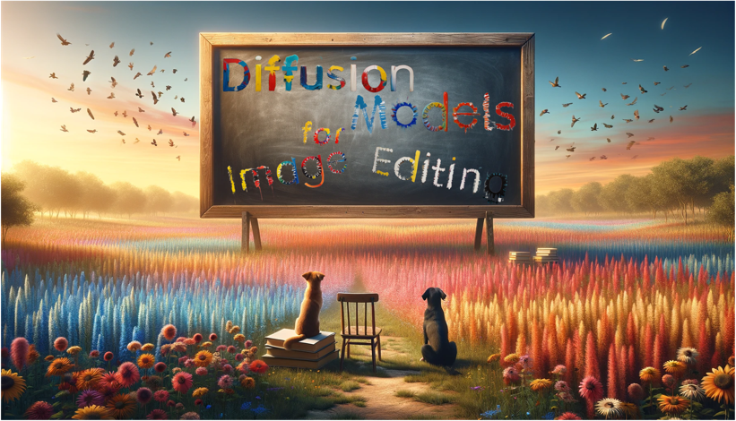

[//]: # (# Diffusion Models for Image Editing)

  

 

 

The repository is based on our survey [Diffusion Model-Based Image Editing: A Survey](https://arxiv.org/pdf/2402.17525.pdf).

Yi Huang, Jiancheng Huang, Yifan Liu, Mingfu Yan, Jiaxi Lv, Jianzhuang Liu, Wei Xiong, He Zhang, Liangliang Cao, Shifeng Chen

Shenzhen Institute of Advanced Technology (SIAT), Chinese Academy of Sciences (CAS), Adobe Inc, Apple Inc, Southern University of Science and Technology (SUSTech)

## Abstract
Denoising diffusion models have emerged as a powerful tool for various image generation and editing tasks, facilitating the synthesis of visual content in an unconditional or input-conditional manner. The core idea behind them is learning to reverse the process of gradually adding noise to images, allowing them to generate high-quality samples from a complex distribution. In this survey, we provide an exhaustive overview of existing methods using diffusion models for image editing, covering both theoretical and practical aspects in the field. 
We delve into a thorough analysis and categorization of these works from multiple perspectives, including learning strategies, user-input conditions, and the array of specific editing tasks that can be accomplished.
In addition, we pay special attention to image inpainting and outpainting, and explore both earlier traditional context-driven and current multimodal conditional methods, offering a comprehensive analysis of their methodologies.
To further evaluate the performance of text-guided image editing algorithms, we propose a systematic benchmark, EditEval, featuring an innovative metric, LMM Score.
Finally, we address current limitations and envision some potential directions for future research.

## 🔖 News!!!

📌 We are tracking the latest work. Free to contact us if you would like to incorporate your studies in this repository and our survey paper.

📰 2024-02-28: Our comprehensive survey paper, summarizing related methods published before February 1, 2024, is now available!

## Table of contents
- [Papers](#papers)
  - [Training-Based](#training-based)
    - [Domain-Specific Editing with Weak Supervision](#domain-specific-editing-with-weak-supervision)
    - [Reference and Attribute Guidance via Self-Supervision](#reference-and-attribute-guidance-via-self-supervision)
    - [Instructional Editing via Full Supervision](#instructional-editing-via-full-supervision)
    - [Pseudo-Target Retrieval with Weak Supervision](#pseudo-target-retrieval-with-weak-supervision)
  - [Testing-Time Finetuning](#testing-time-finetuning)
    - [Denosing Model Finetuning](#denosing-model-finetuning)
    - [Embeddings Finetuning](#embeddings-finetuning)
    - [Guidance with Hypernetworks](#guidance-with-hypernetworks)
    - [Latent Variable Optimization](#latent-variable-optimization)
    - [Hybrid Finetuning](#hybrid-finetuning)
  - [Training and Finetuning Free](#training-and-finetuning-free)
    - [Input Text Refinement](#input-text-refinement)
    - [Inversion/Sampling Modification](#inversionsampling-modification)
    - [Attention Modification](#attention-modification)
    - [Mask Guidance](#mask-guidance)
    - [Multi-Noise Redirection](#multi-noise-redirection)
    
# Papers
## Training-Based

### Domain-Specific Editing with Weak Supervision
**CycleNet: Rethinking Cycle Consistency in Text-Guided Diffusion for Image Manipulation**\
*Xu, Sihan and Ma, Ziqiao and Huang, Yidong and Lee, Honglak and Chai, Joyce*\
NeurIPS 2023. [[Paper](https://arxiv.org/abs/2310.13165)]\
2023.10

**Stylediffusion: Controllable disentangled style transfer via diffusion models**\
*Wang, Zhizhong and Zhao, Lei and Xing, Wei*\
ICCV 2023. [[Paper](https://openaccess.thecvf.com/content/ICCV2023/papers/Wang_StyleDiffusion_Controllable_Disentangled_Style_Transfer_via_Diffusion_Models_ICCV_2023_paper.pdf)]\
2023.08

**Hierarchical diffusion autoencoders and disentangled image manipulation**\
*Lu, Zeyu and Wu, Chengyue and Chen, Xinyuan and Wang, Yaohui and Bai, Lei and Qiao, Yu and Liu, Xihui*\
WACV 2024. [[Paper](https://openaccess.thecvf.com/content/WACV2024/papers/Lu_Hierarchical_Diffusion_Autoencoders_and_Disentangled_Image_Manipulation_WACV_2024_paper.pdf)]\
2023.04

**Towards Real-time Text-driven Image Manipulation with Unconditional Diffusion Models**\
*Starodubcev, Nikita and Baranchuk, Dmitry and Khrulkov, Valentin and Babenko, Artem*\
arXiv 2023. [[Paper](https://arxiv.org/abs/2304.04344)]\
2023.04

**Fine-grained Image Editing by Pixel-wise Guidance Using Diffusion Models**\
*Matsunaga, Naoki and Ishii, Masato and Hayakawa, Akio and Suzuki, Kenji and Narihira, Takuya*\
CVPR 2023 WORKSHOP. [[Paper](https://arxiv.org/pdf/2212.02024.pdf)]\
2022.12

**Diffstyler: Controllable dual diffusion for text-driven image stylization**\
*Huang, Nisha and Zhang, Yuxin and Tang, Fan and Ma, Chongyang and Huang, Haibin and Dong, Weiming and Xu, Changsheng*\
TNNLS 2024. [[Paper](https://arxiv.org/pdf/2211.10682.pdf)]\
2022.11

**Diffusion Models Already Have A Semantic Latent Space**\
*Kwon, Mingi and Jeong, Jaeseok and Uh, Youngjung*\
ICLR. [[Paper](https://arxiv.org/pdf/2210.10960.pdf)]\
2022.10

**Egsde: Unpaired image-to-image translation via energy-guided stochastic differential equations**\
*Zhao, Min and Bao, Fan and Li, Chongxuan and Zhu, Jun*\
NeurIPS 2022. [[Paper](https://arxiv.org/pdf/2207.06635.pdf)]\
2022.07

**Diffusion autoencoders: Toward a meaningful and decodable representation**\
*Preechakul, Konpat and Chatthee, Nattanat and Wizadwongsa, Suttisak and Suwajanakorn, Supasorn*\
CVPR 2022. [[Paper](https://openaccess.thecvf.com/content/CVPR2022/papers/Preechakul_Diffusion_Autoencoders_Toward_a_Meaningful_and_Decodable_Representation_CVPR_2022_paper.pdf)]\
2021.11

**Unit-ddpm: Unpaired image translation with denoising diffusion probabilistic models**\
*Sasaki, Hiroshi and Willcocks, Chris G and Breckon, Toby P*\
arXiv 2021. [[Paper](https://arxiv.org/pdf/2104.05358.pdf)]\
2021.04

**Diffusionclip: Text-guided diffusion models for robust image manipulation**\
*Kim, Gwanghyun and Kwon, Taesung and Ye, Jong Chul*\
CVPR 2022. [[Paper](https://openaccess.thecvf.com/content/CVPR2022/papers/Kim_DiffusionCLIP_Text-Guided_Diffusion_Models_for_Robust_Image_Manipulation_CVPR_2022_paper.pdf)]\
2021.01

### Reference and Attribute Guidance via Self-Supervision

**SmartMask: Context Aware High-Fidelity Mask Generation for Fine-grained Object Insertion and Layout Control**\
*Singh, Jaskirat and Zhang, Jianming and Liu, Qing and Smith, Cameron and Lin, Zhe and Zheng, Liang*\
arXiv 2023. [[Paper](https://arxiv.org/pdf/2312.05039.pdf)]\
2023.12

**A Task is Worth One Word: Learning with Task Prompts for High-Quality Versatile Image Inpainting**\
*Zhuang, Junhao and Zeng, Yanhong and Liu, Wenran and Yuan, Chun and Chen, Kai*\
arXiv 2023. [[Paper](http://arxiv.org/abs/2312.03594)]\
2023.12

**DreamInpainter: Text-Guided Subject-Driven Image Inpainting with Diffusion Models**\
*Xie, Shaoan and Zhao, Yang and Xiao, Zhisheng and Chan, Kelvin CK and Li, Yandong and Xu, Yanwu and Zhang, Kun and Hou, Tingbo*\
arXiv 2023. [[Paper](http://arxiv.org/abs/2312.03771)]\
2023.12

**Uni-paint: A Unified Framework for Multimodal Image Inpainting with Pretrained Diffusion Model**\
*Yang, Shiyuan and Chen, Xiaodong and Liao, Jing*\
ACM MM 2023. [[Paper](https://arxiv.org/abs/2310.07222)]\
2023.10

**Face Aging via Diffusion-based Editing**\
*Xiangyi Chen and Stéphane Lathuilière*\
BMVC 2023. [[Paper](https://arxiv.org/abs/2309.11321)]\
2023.09

**Anydoor: Zero-shot object-level image customization** \
*Chen, Xi and Huang, Lianghua and Liu, Yu and Shen, Yujun and Zhao, Deli and Zhao, Hengshuang* \
arXiv 2023. [[Paper](https://arxiv.org/abs/2307.09481)] \
2023.07

**Paste, Inpaint and Harmonize via Denoising: Subject-Driven Image Editing with Pre-Trained Diffusion Model**\
*Zhang, Xin and Guo, Jiaxian and Yoo, Paul and Matsuo, Yutaka and Iwasawa, Yusuke*\
arXiv 2023. [[Paper](http://arxiv.org/abs/2306.07596)]\
2023.06

**Text-to-image editing by image information removal**\
*Zhang, Zhongping and Zheng, Jian and Fang, Zhiyuan and Plummer, Bryan A*\
WACV 2024. [[Paper](https://arxiv.org/abs/2305.17489)]\
2023.05

**Reference-based Image Composition with Sketch via Structure-aware Diffusion Model**\
*Kim, Kangyeol and Park, Sunghyun and Lee, Junsoo and Choo, Jaegul*\
arXiv 2023. [[Paper](https://arxiv.org/abs/2304.09748)]\
2023.04

**Pair-diffusion: Object-level image editing with structure-and-appearance paired diffusion models**\
*Goel, Vidit and Peruzzo, Elia and Jiang, Yifan and Xu, Dejia and Sebe, Nicu and Darrell, Trevor and Wang, Zhangyang and Shi, Humphrey*\
arXiv 2023. [[Paper](https://arxiv.org/abs/2303.17546)]\
2023.03

**Imagen editor and editbench: Advancing and evaluating text-guided image inpainting**\
*Wang, Su and Saharia, Chitwan and Montgomery, Ceslee and Pont-Tuset, Jordi and Noy, Shai and Pellegrini, Stefano and Onoe, Yasumasa and Laszlo, Sarah and Fleet, David J and Soricut, Radu and others*\
CVPR 2023. [[Paper](https://arxiv.org/abs/2212.06909)]\
2022.12

**Smartbrush: Text and shape guided object inpainting with diffusion model**\
*Xie, Shaoan and Zhang, Zhifei and Lin, Zhe and Hinz, Tobias and Zhang, Kun*\
CVPR 2023. [[Paper](https://arxiv.org/abs/2212.05034)]\
2022.12

**ObjectStitch: Object Compositing With Diffusion Model**\
*Song, Yizhi and Zhang, Zhifei and Lin, Zhe and Cohen, Scott and Price, Brian and Zhang, Jianming and Kim, Soo Ye and Aliaga, Daniel*\
CVPR 2023. [[Paper](http://arxiv.org/abs/2212.00932)]\
2022.12

**Paint by example: Exemplar-based image editing with diffusion models**\
*Yang, Binxin and Gu, Shuyang and Zhang, Bo and Zhang, Ting and Chen, Xuejin and Sun, Xiaoyan and Chen, Dong and Wen, Fang*\
CVPR 2023. [[Paper](https://openaccess.thecvf.com/content/CVPR2023/html/Yang_Paint_by_Example_Exemplar-Based_Image_Editing_With_Diffusion_Models_CVPR_2023_paper.html)]\
2022.11

###  Instructional Editing via Full Supervision
**SmartEdit: Exploring Complex Instruction-based Image Editing with Multimodal Large Language Models**\
*Huang, Yuzhou and Xie, Liangbin and Wang, Xintao and Yuan, Ziyang and Cun, Xiaodong and Ge, Yixiao and Zhou, Jiantao and Dong, Chao and Huang, Rui and Zhang, Ruimao and others*\
arXiv 2023. [[Paper](http://arxiv.org/abs/2312.06739)]\
2023.12

**InstructAny2Pix: Flexible Visual Editing via Multimodal Instruction Following**\
*Li, Shufan and Singh, Harkanwar and Grover, Aditya*\
arXiv 2023. [[Paper](http://arxiv.org/abs/2312.06738)]\
2023.12

**Focus on Your Instruction: Fine-grained and Multi-instruction Image Editing by Attention Modulation**\
*Guo, Qin and Lin, Tianwei*\
arXiv 2023. [[Paper](http://arxiv.org/abs/2312.10113)]\
2023.12

**Emu edit: Precise image editing via recognition and generation tasks**\
*Sheynin, Shelly and Polyak, Adam and Singer, Uriel and Kirstain, Yuval and Zohar, Amit and Ashual, Oron and Parikh, Devi and Taigman, Yaniv*\
arXiv 2023. [[Paper](http://arxiv.org/abs/2311.10089)]\
2023.11

**Guiding instruction-based image editing via multimodal large language models**\
*Fu, Tsu-Jui and Hu, Wenze and Du, Xianzhi and Wang, William Yang and Yang, Yinfei and Gan, Zhe*\
arXiv 2023. [[Paper](http://arxiv.org/abs/2309.17102)]\
2023.09

**Instructdiffusion: A generalist modeling interface for vision tasks**\
*Geng, Zigang and Yang, Binxin and Hang, Tiankai and Li, Chen and Gu, Shuyang and Zhang, Ting and Bao, Jianmin and Zhang, Zheng and Hu, Han and Chen, Dong and others*\
arXiv 2023. [[Paper](https://arxiv.org/abs/2309.03895)]\
2023.09

**MoEController: Instruction-based Arbitrary Image Manipulation with Mixture-of-Expert Controllers**\
*Li, Sijia and Chen, Chen and Lu, Haonan*\
arXiv 2023. [[Paper](https://arxiv.org/abs/2309.04372)]\
2023.09

**ImageBrush: Learning Visual In-Context Instructions for Exemplar-Based Image Manipulation**\
*Yasheng, SUN and Yang, Yifan and Peng, Houwen and Shen, Yifei and Yang, Yuqing and Hu, Han and Qiu, Lili and Koike, Hideki*\
NeurIPS 2023. [[Paper](http://arxiv.org/abs/2308.00906)]\
2023.08

**Inst-Inpaint: Instructing to Remove Objects with Diffusion Models**\
*Yildirim, Ahmet Burak and Baday, Vedat and Erdem, Erkut and Erdem, Aykut and Dundar, Aysegul*\
arXiv 2023. [[Paper](http://arxiv.org/abs/2304.03246)]\
2023.04

**HIVE: Harnessing Human Feedback for Instructional Visual Editing**\
*Zhang, Shu and Yang, Xinyi and Feng, Yihao and Qin, Can and Chen, Chia-Chih and Yu, Ning and Chen, Zeyuan and Wang, Huan and Savarese, Silvio and Ermon, Stefano and others*\
arXiv 2023. [[Paper](https://arxiv.org/abs/2303.09618)]\
2023.03

**DialogPaint: A Dialog-based Image Editing Model**\
*Wei, Jingxuan and Wu, Shiyu and Jiang, Xin and Wang, Yequan*\
arXiv 2023. [[Paper](http://arxiv.org/abs/2303.10073)]\
2023.01

**Learning to Follow Object-Centric Image Editing Instructions Faithfully**\
*Chakrabarty, Tuhin and Singh, Kanishk and Saakyan, Arkadiy and Muresan, Smaranda*\
ACL 2023. [[Paper](https://aclanthology.org/2023.findings-emnlp.646/)]\
2023.01

**Instructpix2pix: Learning to follow image editing instructions**\
*Brooks, Tim and Holynski, Aleksander and Efros, Alexei A*\
CVPR 2023. [[Paper](https://openaccess.thecvf.com/content/CVPR2023/html/Brooks_InstructPix2Pix_Learning_To_Follow_Image_Editing_Instructions_CVPR_2023_paper.html)]\
2022.11

### Pseudo-Target Retrieval with Weak Supervision

**Text-Driven Image Editing  via Learnable Regions** \
*Lin, Yuanze and Chen,  Yi-Wen and Tsai, Yi-Hsuan and Jiang, Lu and Yang, Ming-Hsuan* \
arXiv 2023. [[Paper](https://arxiv.org/abs/2311.16432)] \
2023.11

**iEdit: Localised  Text-guided Image Editing with Weak Supervision** \
*Bodur, Rumeysa and  Gundogdu, Erhan and Bhattarai, Binod and Kim, Tae-Kyun and Donoser, Michael  and Bazzani, Loris* \
arXiv 2023. [[Paper](https://arxiv.org/abs/2305.05947)] \
2023.05

## Testing-Time Finetuning

### Denosing Model Finetuning

**Kv inversion: Kv embeddings learning for text-conditioned real image action editing** \
*Huang, Jiancheng and Liu, Yifan and Qin, Jin and Chen, Shifeng* \
PRCV 2023. [[Paper](https://link.springer.com/chapter/10.1007/978-981-99-8429-9_14)] \
2023.09

**Custom-edit: Text-guided image editing with customized diffusion models** \
*Choi, Jooyoung and Choi, Yunjey and Kim, Yunji and Kim, Junho and Yoon, Sungroh* \
arXiv 2023. [[Paper](https://arxiv.org/abs/2305.15779)] \
2023.05

**Unitune: Text-driven image editing by fine tuning an image generation model on a single image** \
*Valevski, Dani and Kalman, Matan and Matias, Yossi and Leviathan, Yaniv* \
arXiv 2022. [[Paper](https://arxiv.org/abs/2210.09477)] \
2022.10

### Embeddings Finetuning

**Dynamic Prompt Learning: Addressing Cross-Attention Leakage for Text-Based Image Editing** \
*Wang, Kai and Yang, Fei and Yang, Shiqi and Butt, Muhammad Atif and van de Weijer, Joost* \
NeurIPS 2023. [[Paper](https://openreview.net/forum?id=5UXXhVI08r)] \
2023.09

**Prompt Tuning Inversion for Text-Driven Image Editing Using Diffusion Models** \
*Dong, Wenkai and Xue, Song and Duan, Xiaoyue and Han, Shumin* \
ICCV 2023. [[Paper](http://arxiv.org/abs/2305.04441)] \
2023.05

**Uncovering the Disentanglement Capability in Text-to-Image Diffusion Models** \
*Wu, Qiucheng and Liu, Yujian and Zhao, Handong and Kale, Ajinkya and Bui, Trung and Yu, Tong and Lin, Zhe and Zhang, Yang and Chang, Shiyu* \
CVPR 2023. [[Paper](https://openaccess.thecvf.com/content/CVPR2023/html/Wu_Uncovering_the_Disentanglement_Capability_in_Text-to-Image_Diffusion_Models_CVPR_2023_paper.html)] \
2022.12

**Null-text inversion for editing real images using guided diffusion models** \
*Mokady, Ron and Hertz, Amir and Aberman, Kfir and Pritch, Yael and Cohen-Or, Daniel* \
CVPR 2023. [[Paper](https://openaccess.thecvf.com/content/CVPR2023/html/Mokady_NULL-Text_Inversion_for_Editing_Real_Images_Using_Guided_Diffusion_Models_CVPR_2023_paper.html)] \
2022.11

### Guidance with Hypernetworks

**StyleDiffusion: Prompt-Embedding Inversion for Text-Based Editing** \
*Li, Senmao and van de Weijer, Joost and Hu, Taihang and Khan, Fahad Shahbaz and Hou, Qibin and Wang, Yaxing and Yang, Jian* \
arXiv 2023. [[Paper](https://arxiv.org/abs/2303.15649)] \
2023.05

**Inversion-based creativity transfer with diffusion models** \
*Zhang, Yuxin and Huang, Nisha and Tang, Fan and Huang, Haibin and Ma, Chongyang and Dong, Weiming and Xu, Changsheng* \
ARXOV 2022. [[Paper](https://arxiv.org/abs/2211.13203)] \
2022.11

### Latent Variable Optimization

**Contrastive Denoising Score for Text-guided Latent Diffusion Image Editing** \
*Nam, Hyelin and Kwon, Gihyun and Park, Geon Yeong and Ye, Jong Chul* \
arXiv 2023. [[Paper](https://arxiv.org/abs/2311.18608)] \
2023.11

**MagicRemover: Tuning-free Text-guided Image inpainting with Diffusion Models** \
*Yang, Siyuan and Zhang, Lu and Ma, Liqian and Liu, Yu and Fu, JingJing and He, You* \
arXiv 2023. [[Paper](https://arxiv.org/abs/2310.02848)] \
2023.10

**Dragondiffusion: Enabling drag-style manipulation on diffusion models** \
*Mou, Chong and Wang, Xintao and Song, Jiechong and Shan, Ying and Zhang, Jian* \
arXiv 2023. [[Paper](https://arxiv.org/abs/2307.02421)] \
2023.07

**DragDiffusion: Harnessing Diffusion Models for Interactive Point-based Image Editing** \
*Shi, Yujun and Xue, Chuhui and Pan, Jiachun and Zhang, Wenqing and Tan, Vincent YF and Bai, Song* \
arXiv 2023. [[Paper](https://arxiv.org/abs/2306.14435)] \
2023.06

**Delta denoising score** \
*Hertz, Amir and Aberman, Kfir and Cohen-Or, Daniel* \
ICCV 2023. [[Paper](https://openaccess.thecvf.com/content/ICCV2023/html/Hertz_Delta_Denoising_Score_ICCV_2023_paper.html)] \
2023.04

**Diffusion-based Image Translation using disentangled style and content representation** \
*Kwon, Gihyun and Ye, Jong Chul* \
ICLR. [[Paper](https://arxiv.org/abs/2209.15264)] \
2022.09

### Hybrid Finetuning

**Forgedit: Text Guided Image Editing via Learning and Forgetting** \
*Zhang, Shiwen and Xiao, Shuai and Huang, Weilin* \
arXiv 2023. [[Paper](https://arxiv.org/abs/2309.10556)] \
2023.09

**LayerDiffusion: Layered Controlled Image Editing with Diffusion Models** \
*Li, Pengzhi and Huang, QInxuan and Ding, Yikang and Li, Zhiheng* \
arXiv 2023. [[Paper](https://arxiv.org/abs/2305.18676)] \
2023.05

**Sine: Single image editing with text-to-image diffusion models** \
*Zhang, Zhixing and Han, Ligong and Ghosh, Arnab and Metaxas, Dimitris N and Ren, Jian* \
CVPR 2023. [[Paper](https://openaccess.thecvf.com/content/CVPR2023/html/Zhang_SINE_SINgle_Image_Editing_With_Text-to-Image_Diffusion_Models_CVPR_2023_paper.html)] \
2022.12

**Imagic: Text-Based Real Image Editing With Diffusion Models** \
*Kawar, Bahjat and Zada, Shiran and Lang, Oran and Tov, Omer and Chang, Huiwen and Dekel, Tali and Mosseri, Inbar and Irani, Michal* \
CVPR 2023. [[Paper](https://openaccess.thecvf.com/content/CVPR2023/html/Kawar_Imagic_Text-Based_Real_Image_Editing_With_Diffusion_Models_CVPR_2023_paper.html)] \
2022.10

## Training and Finetuning Free

### Input Text Refinement

**User-friendly Image Editing with Minimal Text Input: Leveraging Captioning and Injection Techniques** \
*Kim, Sunwoo and Jang, Wooseok and Kim, Hyunsu and Kim, Junho and Choi, Yunjey and Kim, Seungryong and Lee, Gayeong* \
arXiv 2023. [[Paper](https://arxiv.org/abs/2306.02717)] \
2023.06

**ReGeneration Learning of Diffusion Models with Rich Prompts for Zero-Shot Image Translation** \
*Lin, Yupei and Zhang, Sen and Yang, Xiaojun and Wang, Xiao and Shi, Yukai* \
arXiv 2023. [[Paper](https://arxiv.org/abs/2305.04651)] \
2023.05

**InstructEdit: Improving Automatic Masks for Diffusion-based Image Editing With User Instructions** \
*Wang, Qian and Zhang, Biao and Birsak, Michael and Wonka, Peter* \
arXiv 2023. [[Paper](https://arxiv.org/abs/2305.18047)] \
2023.05

**Preditor: Text guided image editing with diffusion prior** \
*Ravi, Hareesh and Kelkar, Sachin and Harikumar, Midhun and Kale, Ajinkya* \
arXiv 2023. [[Paper](https://arxiv.org/abs/2302.07979)] \
2023.02

### Inversion/Sampling Modification
**Fixed-point Inversion for Text-to-image diffusion models** \
*Meiri, Barak and Samuel, Dvir and Darshan, Nir and Chechik, Gal and Avidan, Shai and Ben-Ari, Rami* \
arXiv 2023. [[Paper](https://arxiv.org/abs/2312.12540)] \
2023.12

**Tuning-Free Inversion-Enhanced Control for Consistent Image Editing** \
*Duan, Xiaoyue and Cui, Shuhao and Kang, Guoliang and Zhang, Baochang and Fei, Zhengcong and Fan, Mingyuan and Huang, Junshi* \
arXiv 2023. [[Paper](https://arxiv.org/abs/2312.14611)] \
2023.12

**The Blessing of Randomness: SDE Beats ODE in General Diffusion-based Image Editing** \
*Nie, Shen and Guo, Hanzhong Allan and Lu, Cheng and Zhou, Yuhao and Zheng, Chenyu and Li, Chongxuan* \
arXiv 2023. [[Paper](https://arxiv.org/abs/2311.01410)] \
2023.11

**LEDITS++: Limitless Image Editing using Text-to-Image Models** \
*Brack, Manuel and Friedrich, Felix and Kornmeier, Katharina and Tsaban, Linoy and Schramowski, Patrick and Kersting, Kristian and Passos, Apolinário* \
arXiv 2023. [[Paper](https://arxiv.org/abs/2311.16711)] \
2023.11

**A latent space of stochastic diffusion models for zero-shot image editing and guidance** \
*Wu, Chen Henry and De la Torre, Fernando* \
ICCV 2023. [[Paper](https://openaccess.thecvf.com/content/ICCV2023/html/Wu_A_Latent_Space_of_Stochastic_Diffusion_Models_for_Zero-Shot_Image_ICCV_2023_paper.html)] \
2023.10

**Effective real image editing with accelerated iterative diffusion inversion** \
*Pan, Zhihong and Gherardi, Riccardo and Xie, Xiufeng and Huang, Stephen* \
ICCV 2023. [[Paper](https://openaccess.thecvf.com/content/ICCV2023/html/Pan_Effective_Real_Image_Editing_with_Accelerated_Iterative_Diffusion_Inversion_ICCV_2023_paper.html)] \
2023.09

**Fec: Three finetuning-free methods to enhance consistency for real image editing** \
*Chen, Songyan and Huang, Jiancheng* \
arXiv 2023. [[Paper](https://arxiv.org/abs/2309.14934)] \
2023.09

**Iterative multi-granular image editing using diffusion models** \
*Joseph, KJ and Udhayanan, Prateksha and Shukla, Tripti and Agarwal, Aishwarya and Karanam, Srikrishna and Goswami, Koustava and Srinivasan, Balaji Vasan* \
arXiv 2024. [[Paper](https://arxiv.org/abs/2309.00613)] \
2023.09

**ProxEdit: Improving Tuning-Free Real Image Editing With Proximal Guidance** \
*Han, Ligong and Wen, Song and Chen, Qi and Zhang, Zhixing and Song, Kunpeng and Ren, Mengwei and Gao, Ruijiang and Chen, Yuxiao and Di Liu 0003 and Zhangli, Qilong and others* \
WACV 2024. [[Paper](https://arxiv.org/abs/2306.05414)] \
2023.06

**Diffusion self-guidance for controllable image generation** \
*Epstein, Dave and Jabri, Allan and Poole, Ben and Efros, Alexei A and Holynski, Aleksander* \
arXiv 2023. [[Paper](https://arxiv.org/abs/2306.00986)] \
2023.06

**Diffusion Brush: A Latent Diffusion Model-based Editing Tool for AI-generated Images** \
*Gholami, Peyman and Xiao, Robert* \
arXiv 2023. [[Paper](https://arxiv.org/abs/2306.00219)] \
2023.06

**Negative-prompt Inversion: Fast Image Inversion for Editing with Text-guided Diffusion Models** \
*Miyake, Daiki and Iohara, Akihiro and Saito, Yu and Tanaka, Toshiyuki* \
arXiv 2023. [[Paper](https://arxiv.org/abs/2305.16807)] \
2023.05

**An Edit Friendly DDPM Noise Space: Inversion and Manipulations** \
*Huberman-Spiegelglas, Inbar and Kulikov, Vladimir and Michaeli, Tomer* \
arXiv 2023. [[Paper](https://github.com/inbarhub/DDPM_inversion)] \
2023.04

**Training-Free Content Injection Using H-Space in Diffusion Models** \
*Jeong, Jaeseok and Kwon, Mingi and Uh, Youngjung* \
WACV 2024. [[Paper](https://arxiv.org/abs/2303.15403)] \
2023.03

**Edict: Exact diffusion inversion via coupled transformations** \
*Wallace, Bram and Gokul, Akash and Naik, Nikhil* \
CVPR 2023. [[Paper](https://openaccess.thecvf.com/content/CVPR2023/html/Wallace_EDICT_Exact_Diffusion_Inversion_via_Coupled_Transformations_CVPR_2023_paper.html)] \
2022.11

**Direct inversion: Optimization-free text-driven real image editing with diffusion models** \
*Elarabawy, Adham and Kamath, Harish and Denton, Samuel* \
arXiv 2022. [[Paper](https://arxiv.org/abs/2211.07825)] \
2022.11

### Attention Modification

**HD-Painter: High-Resolution and Prompt-Faithful Text-Guided Image Inpainting with Diffusion Models** \
*Manukyan, Hayk and Sargsyan, Andranik and Atanyan, Barsegh and Wang, Zhangyang and Navasardyan, Shant and Shi, Humphrey* \
arXiv 2023. [[Paper](https://arxiv.org/abs/2312.14091)] \
2023.12

**Tf-icon: Diffusion-based training-free cross-domain image composition** \
*Lu, Shilin and Liu, Yanzhu and Kong, Adams Wai-Kin* \
ICCV 2023. [[Paper](https://arxiv.org/abs/2307.12493)] \
2023.07

**Energy-Based Cross Attention for Bayesian Context Update in Text-to-Image Diffusion Models** \
*Park, Geon Yeong and Kim, Jeongsol and Kim, Beomsu and Lee, Sang Wan and Ye, Jong Chul* \
NeurIPS 2023. [[Paper](https://arxiv.org/abs/2306.09869)] \
2023.06

**Conditional Score Guidance for Text-Driven Image-to-Image Translation** \
*Lee, Hyunsoo and Kang, Minsoo and Han, Bohyung* \
NeurIPS 2023. [[Paper](https://arxiv.org/abs/2305.18007)] \
2023.05

**MasaCtrl: Tuning-Free Mutual Self-Attention Control for Consistent Image Synthesis and Editing** \
*Cao, Mingdeng and Wang, Xintao and Qi, Zhongang and Shan, Ying and Qie, Xiaohu and Zheng, Yinqiang* \
arXiv 2023. [[Paper](https://arxiv.org/abs/2304.08465)] \
2023.04

**Localizing Object-level Shape Variations with Text-to-Image Diffusion Models** \
*Patashnik, Or and Garibi, Daniel and Azuri, Idan and Averbuch-Elor, Hadar and Cohen-Or, Daniel* \
ICCV 2023. [[Paper](https://arxiv.org/abs/2303.11306)] \
2023.03

**Zero-shot image-to-image translation** \
*Parmar, Gaurav and Kumar Singh, Krishna and Zhang, Richard and Li, Yijun and Lu, Jingwan and Zhu, Jun-Yan* \
ACM SIGGRAPH 2023. [[Paper](https://dl.acm.org/doi/abs/10.1145/3588432.3591513)] \
2023.02

**Shape-Guided Diffusion With Inside-Outside Attention** \
*Park, Dong Huk and Luo, Grace and Toste, Clayton and Azadi, Samaneh and Liu, Xihui and Karalashvili, Maka and Rohrbach, Anna and Darrell, Trevor* \
WACV 2024. [[Paper](https://openaccess.thecvf.com/content/WACV2024/html/Park_Shape-Guided_Diffusion_With_Inside-Outside_Attention_WACV_2024_paper.html)] \
2022.12

**Plug-and-play diffusion features for text-driven image-to-image translation** \
*Tumanyan, Narek and Geyer, Michal and Bagon, Shai and Dekel, Tali* \
CVPR 2023. [[Paper](https://openaccess.thecvf.com/content/CVPR2023/html/Tumanyan_Plug-and-Play_Diffusion_Features_for_Text-Driven_Image-to-Image_Translation_CVPR_2023_paper.html)] \
2022.11

**Prompt-to-prompt image editing with cross attention control** \
*Hertz, Amir and Mokady, Ron and Tenenbaum, Jay and Aberman, Kfir and Pritch, Yael and Cohen-Or, Daniel* \
ICLR. [[Paper](https://openreview.net/forum?id=_CDixzkzeyb)] \
2022.08

### Mask Guidance

**ZONE: Zero-Shot Instruction-Guided Local Editing** \
*Li, Shanglin and Zeng, Bohan and Feng, Yutang and Gao, Sicheng and Liu, Xuhui and Liu, Jiaming and Lin, Li and Tang, Xu and Hu, Yao and Liu, Jianzhuang and others* \
arXiv 2023. [[Paper](https://arxiv.org/abs/2312.16794)] \
2023.12

**Watch your steps: Local image and scene editing by text instructions** \
*Mirzaei, Ashkan and Aumentado-Armstrong, Tristan and Brubaker, Marcus A and Kelly, Jonathan and Levinshtein, Alex and Derpanis, Konstantinos G and Gilitschenski, Igor* \
arXiv 2023. [[Paper](https://arxiv.org/abs/2308.08947)] \
2023.08

**Energy-Based Cross Attention for Bayesian Context Update in Text-to-Image Diffusion Models** \
*Park, Geon Yeong and Kim, Jeongsol and Kim, Beomsu and Lee, Sang Wan and Ye, Jong Chul* \
NeurIPS 2023. [[Paper](https://arxiv.org/abs/2306.09869)] \
2023.06

**Differential Diffusion: Giving Each Pixel Its Strength** \
*Levin, Eran and Fried, Ohad* \
arXiv 2023. [[Paper](https://arxiv.org/abs/2306.00950)] \
2023.06

**PFB-Diff: Progressive Feature Blending Diffusion for Text-driven Image Editing** \
*Huang, Wenjing and Tu, Shikui and Xu, Lei* \
arXiv 2023. [[Paper](https://arxiv.org/abs/2306.16894)] \
2023.06

**FISEdit: Accelerating Text-to-image Editing via Cache-enabled Sparse Diffusion Inference** \
*Yu, Zihao and Li, Haoyang and Fu, Fangcheng and Miao, Xupeng and Cui, Bin* \
AAAI 2023. [[Paper](https://arxiv.org/abs/2305.17423)] \
2023.05

**Inpaint anything: Segment anything meets image inpainting** \
*Yu, Tao and Feng, Runseng and Feng, Ruoyu and Liu, Jinming and Jin, Xin and Zeng, Wenjun and Chen, Zhibo* \
arXiv 2023. [[Paper](https://arxiv.org/abs/2304.06790)] \
2023.04

**Region-aware diffusion for zero-shot text-driven image editing** \
*Huang, Nisha and Tang, Fan and Dong, Weiming and Lee, Tong-Yee and Xu, Changsheng* \
CVM 2023. [[Paper](https://arxiv.org/abs/2302.11797)] \
2023.02

**Text-guided mask-free local image retouching** \
*Liu, Zerun and Zhang, Fan and He, Jingxuan and Wang, Jin and Wang, Zhangye and Cheng, Lechao* \
ICME 2023. [[Paper](https://ieeexplore.ieee.org/abstract/document/10219704)] \
2022.12

**Blended diffusion for text-driven editing of natural images** \
*Avrahami, Omri and Lischinski, Dani and Fried, Ohad* \
CVPR 2022. [[Paper](https://openaccess.thecvf.com/content/CVPR2022/papers/Avrahami_Blended_Diffusion_for_Text-Driven_Editing_of_Natural_Images_CVPR_2022_paper.pdf)] \
2021.11

**DiffEdit: Diffusion-based semantic image editing with mask guidance** \
*Couairon, Guillaume and Verbeek, Jakob and Schwenk, Holger and Cord, Matthieu* \
ICLR. [[Paper](https://openreview.net/forum?id=3lge0p5o-M-)] \
2022.10

**Blended latent diffusion** \
*Avrahami, Omri and Fried, Ohad and Lischinski, Dani* \
SIGGRAPH 2023. [[Paper](https://arxiv.org/abs/2206.02779)] \
2022.06

### Multi-Noise Redirection

**Object-aware Inversion and Reassembly for Image Editing** \
*Yang, Zhen and Gui, Dinggang and Wang, Wen and Chen, Hao and Zhuang, Bohan and Shen, Chunhua* \
arXiv 2023. [[Paper](https://arxiv.org/abs/2310.12149)] \
2023.10

**Ledits: Real image editing with ddpm inversion and semantic guidance** \
*Tsaban, Linoy and Passos, Apolin{\'a}rio* \
arXiv 2023. [[Paper](https://arxiv.org/abs/2307.00522)] \
2023.07

**Sega: Instructing diffusion using semantic dimensions** \
*Brack, Manuel and Friedrich, Felix and Hintersdorf, Dominik and Struppek, Lukas and Schramowski, Patrick and Kersting, Kristian* \
arXiv 2023. [[Paper](https://arxiv.org/abs/2301.12247)] \
2023.01

**The stable artist: Steering semantics in diffusion latent space** \
*Brack, Manuel and Schramowski, Patrick and Friedrich, Felix and Hintersdorf, Dominik and Kersting, Kristian* \
arXiv 2022. [[Paper](https://arxiv.org/abs/2212.06013)] \
2022.12

